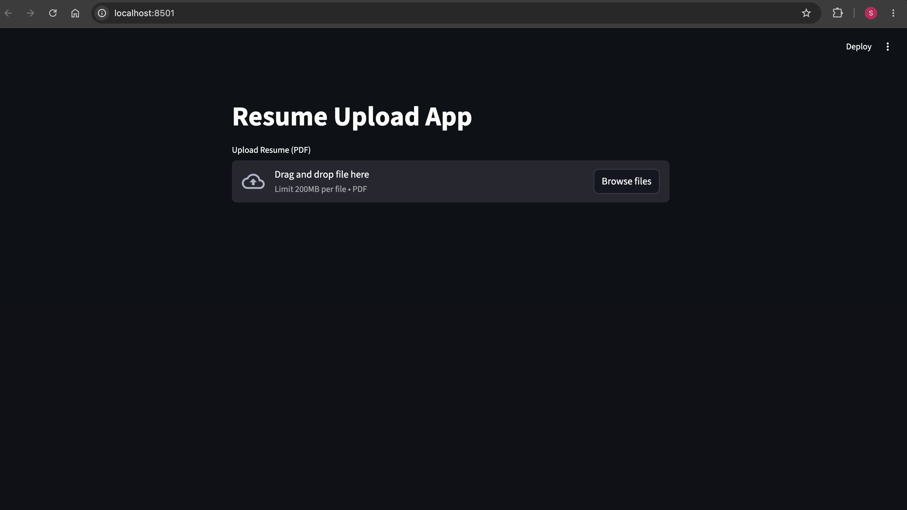
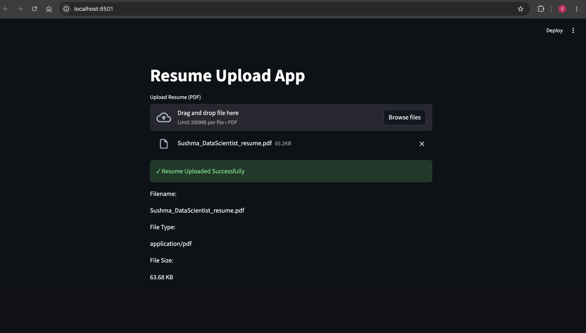

# Resume Upload App

A simple Streamlit application that allows users to upload a resume and view basic file metadata.

## Features

* Upload resume files
* Supports PDF and DOCX formats
* Displays:

  * File Name
  * File Type
  * File Size
* File format validation
* User-friendly upload interface

### Upload Resume



### Upload Success



## Project Structure
resume-upload-app/
│
├── app.py
├── requirements.txt
├── README.md
└── screenshots/
    ├── upload-page.png
    └── upload-success.png

## Installation
pip install -r requirements.txt
```

## Run the Application

```bash
streamlit run app.py
```

## Technologies Used

* Python
* Streamlit

## Output

After uploading a resume, the application displays:

* Filename
* File Type
* File Size

along with a success message confirming the upload.
